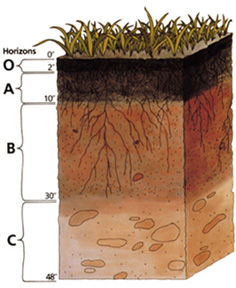

# Onderwerp

## Definities en afkortingen

```{=html}
<!--
Definities van begrippen en afkortingen die noodzakelijk zijn om dit document te begrijpen en het protocol op een gepaste manier te kunnen uitvoeren.
-->
```

-   *bodemlaag* Een door sedimentatie afgezette laag in het bodemprofiel.

-   *bodemhorizont* Een bodemhorizont of kortweg horizont is een door bodemvormende processen gevormde zone in het bodemprofiel

-   *bodemprofiel* Het geheel van bodemhorizonten en bodemlagen vanaf het moedermateriaal tot aan het bodemoppervlak.
    Zie Figuur \@ref(fig:profiel).

```{r bodemprofiel, fig.cap="(ref:profiel)"}

```

## Doelstelling en toepassingsgebied

<!-- description: start -->

Dit protocol geeft weer hoe een bodemprofielbeschrijving dient te gebeuren.
<!-- description: end -->

```{=html}
<!--
Doelstelling: omschrijving in woorden waarvoor het protocol dient.
Voorbeelden wat er met de gegevens kan gedaan worden.
Probeer de doelstelling zo veel mogelijk generiek te beschrijven en vermijd projectspecifieke doelstellingen.
Toepassingsgebied: bespreek hier onder welke condities het protocol kan gebruikt worden.
-->
```

Doelstelling: stappenplan om een bodemprofiel op een gestandaardiseerde manier te beschrijven.

Toepassingsgebied: alle bodemtypes die in België voorkomen
